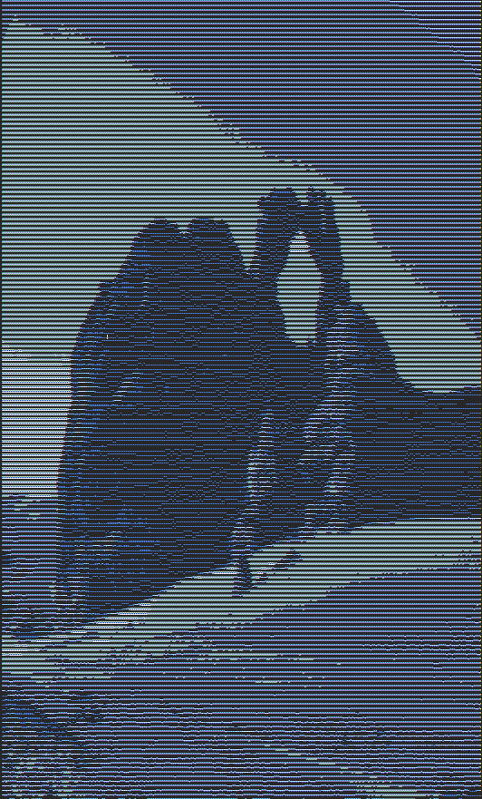
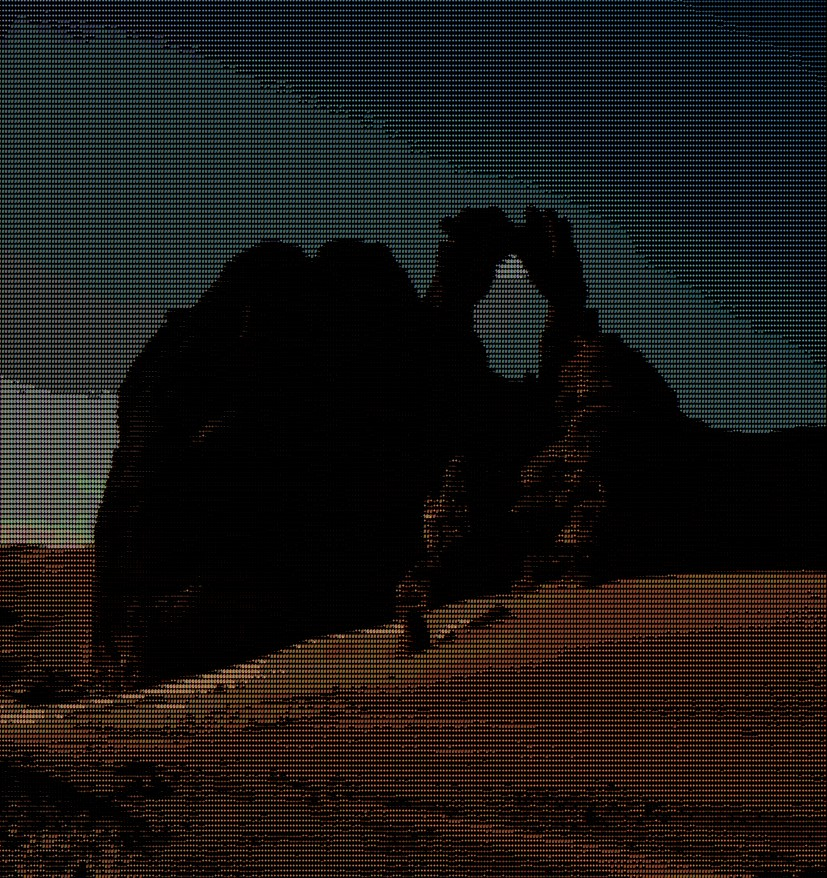

# DAI_Practical_Work_1_Magic_Image_CLI
This project was conceptualized and realised by Guillaume Fragnière and Killian Viquerat in the context of the DAI class in HEIG-VD.
## Introduction
This program is a small project coded in Java, and it's purpose is to apply some image treatments over a given `.bmp`file.
The project supports 4 main features, namely:
- Gray-scaling an image.
- Reducing the pepper noise on a gray-scaled image.
- Applying a blur effect on an image.
- Converting an image into ASCII, colored or not depending on the options given.

The exact usage of the different features will be detailed and explained later in this document.
## Implementation
This project was created with the intent of being usable in the command line. Therefore, we used the picocli framework to do so.
To package the application, we also used Maven for the creation of a `.jar` executable file.

We also decided to only be able to apply the filters to `.bmp` files for complexity purposes, such as treating the compression in other image format, which can be very tedious and time-consuming.

The writing of the output file is similar in 3 out of the 4 filters, the only special case being the `ASCII treatment`. Therefore, we created a class called `BMPWriter` in order to write the image in the `.bmp` format output file used with the 3 other image treatments, namely `PepperReduction`, `GrayScale` and `Blur`.

Since the `ASCII treatment` writes to a text file (`.txt` for the gray-scaled and `.html` for the colored), we have chosen to write the output file inside the `Process` file, resulting in an unpleasing code block. With the implementations we made, we saw it as a good compromise between keeping the other features clean and not being to complex.

## GitHub
To create and organize our workflow, we used a GitHub repository.
### Work separation
In order to properly work on this project, we used a workflow which consisted of:
1. Creating an issue regarding a new feature/problem.
2. Creating a branch locally in order to implement the idea/fix the problem.
3. Make the changes locally, and then commit the changes onto the branch in the GitHub repository.
4. Create a pull request to merge the branch created and the main branch, and link it to the corresponding issue in order to close it. 
5. The pull request must be approved by the person that did not work on the feature in order to force reviews to make sure that unnecessary features/coding problems would not be inserted into the main branch.

Since the project consists of 4 different features, each feature was assigned a branch. The CLI integration using picocli was also assigned a specific branch. Note that this integration was heavily inspired by the practical content `java-ios` of the DAI class.

## How to contribute

### Git Clone
Your first step is to clone the project from the repo to your computer

```bash
git clone git@github.com:Killian-Viquerat/DAI_Practical_Work_1_Magic_Image_CLI.git
```

### IntelliJ Idea 

If your using IntelliJ IDEA, the configuration for the packaging of the application will be automatically available inside the IDE.
As well as the running one. 

The running configuration will just not have parameters precised, so you will need to add them to use the different command available.

## Maven

For those using only the command line, to package the application you will need to run this command: 

```bash
mvn dependency:go-offline clean compile package
```

## Running the application 

After packaging the application you can run this command to print the help message:
```bash
java -jar ./target/DAI_Practical_Work_1_Magic_Image_CLI-1.0-SNAPSHOT.jar -h

Usage: DAI_Practical_Work_1_Magic_Image_CLI-1.0-SNAPSHOT.jar [-chV] [-s=<size>]
       -t=<treatment> <filename> <output> [COMMAND]
A CLI application for the treatment of BMP images
      <filename>      The input image file name
      <output>        The output file name
  -c, --color         Precise the output for the ascii file(used = html file
                        with colored char | unused = txt file with black and
                        white char )
  -h, --help          Show this help message and exit.
  -s, --size=<size>   The size of the kernel used to average pixel together for
                        the ascii effect (must be an odd number).
  -t, --treatment=<treatment>
                      The treatment used on the BMP file (possible treatments
                        being: GrayScale, PepperReduction, ImageToAscii, Blur).
  -V, --version       Print version information and exit.
```

This will help in order to compose the different command to test the different feature implemented in the application.

You can refer to the [Features](#feature) described in the Readme:

- [Gray scale](#grayscale)
- [Pepper reduction](#pepper)
- [Image to ASCII](#ascii)
- [Blur](#blur)

## <a id="feature"></a>Features
Each features apply a treatment on the given image using the `applyEffect` function inherited by all classes from the `Effect` interface.

## <a id="grayscale"></a>Gray scale
The gray scale feature is pretty explicit in its usage: it takes the given image and converts it in a gray-scaled version of it. In order to correctly get the color from each pixel of the image, it goes over every pixel, computes the average of the Red/Green/Blue values and sets this value into the pixels color components.

Example of application:


<div style="display:inline-block; width: 10px"></div>


using 
```bash
java -jar ./target/DAI_Practical_Work_1_Magic_Image_CLI-1.0-SNAPSHOT.jar -t=GrayScale src/images/input/inputColored.bmp src/images/output/outputGrayScaled.bmp bmp_treatment
```
### <a id="pepper"></a>Pepper reduction
The pepper reduction feature reduces the pepper noise on a gray-scaled image. In order to force the treatment of a gray-scaled image, we apply the `GrayScale` feature first to the input file, no matter if it is gray-scaled or not as a security measure.

This feature works by, in order:
1. For each pixel, looking to his up to 8 neighbours and itself and storing their color value in an array.
2. Sorts this array.
3. Assigning the middle value of the sorted array of neighbours to his color value in order to replace incoherent values, such as white dots or black dotes.

Example of application:


<div style="display:inline-block; width: 10px"></div>


using
```bash
java -jar ./target/DAI_Practical_Work_1_Magic_Image_CLI-1.0-SNAPSHOT.jar -t=PepperReduction src/images/input/inputPepper.bmp src/images/output/outputPepper.bmp bmp_treatment
```
### <a id="ascii"></a>Image to ASCII
The Image to Ascii feature permit a user to convert an image file to a text file that contain the image as character. 

This feature work like this:
1. The image is turn to gray.
2. A kernel of size x*x specified by the -s argument. This kernel will reduce the x\*x pixels to an average of rgb and create a new pixel resulting in a lower quality image to treat.
3. Then we use the average of luminosity of the pixel to map it to an index of the array of character representing the luminosity.
4. The data are then written in a txt file.

Example of application:

First, gray-scaled ASCII:


<div style="display:inline-block; width: 10px"></div>


using
```bash
java -jar ./target/DAI_Practical_Work_1_Magic_Image_CLI-1.0-SNAPSHOT.jar -t=ImageToAscii src/images/input/inputPepper.bmp src/images/output/outputAsciiGrayScaled.txt bmp_treatment
```

Then, colored ASCII: 

This feature works the same as the one for the gray-scaled Ascii.

1. The image is not turned to gray to keep the colors.
2. We apply the kernel to reduce the quality.
3. To highlight the text with colors, it uses the HTML tags to represent each character with a defined style:
```html
    <div style="width: 10px; display: inline-block; color: rgb(170.36,113.36,156.28)">The luminosity char</div>
``` 
4. The data are then written in a html file.


<div style="display:inline-block; width: 10px"></div>


using
```bash
java -jar ./target/DAI_Practical_Work_1_Magic_Image_CLI-1.0-SNAPSHOT.jar -t=ImageToAscii -c src/images/input/inputPepper.bmp src/images/output/outputAsciiColored.html bmp_treatment
```
### <a id="blur"></a> Blur
The blur feature is exactly what is name is stating, it takes an image and turn it into a blurry image.
In order to get the effect of blur we use a kernel called Blur box that we found on [wikipedia](https://en.wikipedia.org/wiki/Kernel_(image_processing)) .
It uses image convolution applied to the image to make a new pixel from the 1/9 of all the pixel in the kernel.

Example of application:


<div style="display:inline-block; width: 10px"></div>


using
```bash
java -jar ./target/DAI_Practical_Work_1_Magic_Image_CLI-1.0-SNAPSHOT.jar -t=GrayScale src/images/input/inputColored.bmp src/images/output/outputGrayScaled.bmp bmp_treatment
```


Note that the blurring effect is not very visible on those images because of their high definition and the "low scale" of our kernel for the blurring effect.
## Dependencies

### The main dependencies we have in this project are:
#### Color made available in java by the java.awt.Paint package
- we use Color to help us with the representation of pixel by using the r,g,b attributes present in the class.
#### Math made available in java by the java.lang.Math package
- we use Math to use some mathematical function already implemented and preventing us from making the wheel again.


